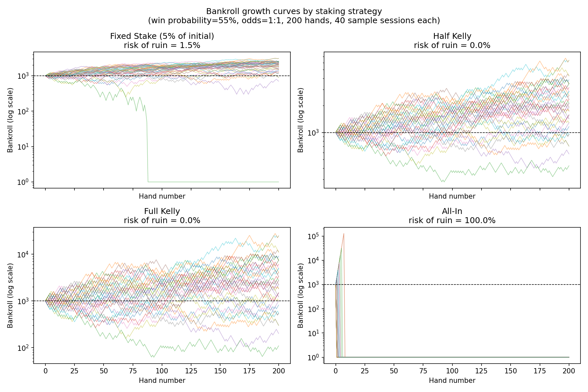
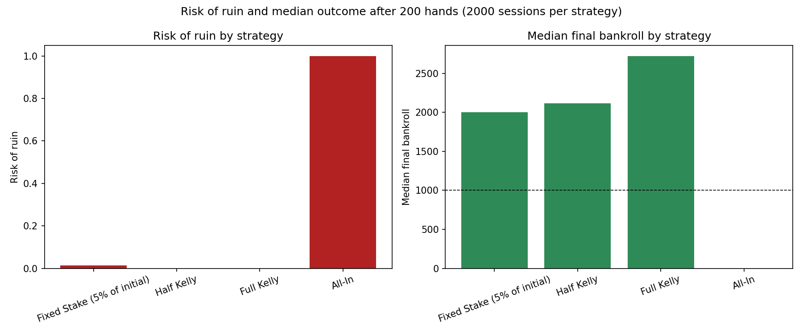

# Project 3: Kelly Poker Simulator

A progressive, self-taught, full-stack project that builds a Texas Hold'em simulator with AI
opponents and a virtual bankroll manager sized using the **Kelly Criterion**.

No real money is involved anywhere — this is a simulator/game against AI opponents using a
virtual bankroll only.

## Why poker?

The Kelly Criterion was originally developed for gambling/bankroll management and is the exact
same formula used for position-sizing in real investment portfolios (Ed Thorp — professional
card counter turned quant hedge fund manager — is the classic example). Poker gives a clean,
self-contained environment (known edge, known odds, discrete bets) to learn the formula before
applying the same thinking to a portfolio.

## Tech stack

- **Backend:** FastAPI (Python)
- **Frontend:** React
- **Database:** PostgreSQL
- **Auth:** JWT-based authentication (password hashing, protected routes)

Early parts (1–7) are plain Python with no web stack — the goal is to get the game/math logic
solid and tested before any API or UI is built on top of it.

## Progress

| Part | Topic | Status |
|---|---|---|
| 1 | Cards, Deck & Dealing | ✅ Done |
| 2 | Hand Evaluator | ✅ Done |
| 3 | Monte Carlo Equity Calculator | ✅ Done |
| 4 | Expected Value & Pot Odds | ✅ Done |
| 5 | The Kelly Criterion | ✅ Done |
| 6 | Bankroll Simulator | ✅ Done |
| 7 | Simple AI Opponents | ✅ Done |
| 8 | Backend API (FastAPI) | ✅ Done |
| 9 | Authentication & Security | ✅ Done |
| 10 | Frontend (React) | ✅ Done |
| 11 | Deployment | ✅ Done |
| 12 | Real Poker Engine (multi-street, multi-opponent, side pots) | 🔄 In progress |

## Setup

```bash
python3 -m venv venv
source venv/bin/activate
pip install -r requirements.txt
pytest
```

One-time, to enable local pre-commit checks (pytest + frontend lint/tests before every commit,
see `.pre-commit-config.yaml`):

```bash
pre-commit install
```

---

## Part 1: Cards, Deck & Dealing

**Key insight:** A deck is just 52 unique `(rank, suit)` pairs. Dealing without duplicating cards
is trivial if you treat the deck as a mutable pool you *remove* cards from — once a card is dealt,
it physically leaves the deck, so there is no way to deal it twice. That single design decision
(deal = pop from the deck) is what guarantees no-duplicate dealing, rather than any explicit
"has this card already been dealt?" check.

- `poker/cards.py` — `Suit` and `Rank` enums, and an immutable `Card` (rank + suit), with a
  compact string form (e.g. `Ah` = Ace of hearts, `Tc` = Ten of clubs — standard poker notation,
  `T` for ten avoids confusion with `10` taking two characters).
- `poker/deck.py` — `Deck` builds all 52 cards, `shuffle()`s them, and deals via `deal(n)`
  (generic), `deal_hole_cards(num_players)` (2 cards per player, one at a time in dealing order),
  and `deal_community(n)` (flop/turn/river).

Run just this part's tests:

```bash
pytest tests/test_cards.py tests/test_deck.py -v
```

---

## Part 2: Hand Evaluator

**Key insight:** every 5-card hand can be reduced to one sortable tuple:
`(category, tiebreakers)`. Once every hand is turned into one of these tuples, deciding a winner
is just Python's `max()` over tuples — no special-cased "if flush beats straight" logic is
needed anywhere, because tuple comparison already checks the category first and only falls
through to tiebreakers when two hands share a category.

The tiebreakers themselves come from one trick: group the 5 ranks by how often each appears,
then sort those groups by `(count, rank)` descending. That single ordering produces the correct
tiebreak order for every category that involves duplicate ranks — e.g. for two pair the result is
`(high_pair, low_pair, kicker)`, which is exactly the order poker rules say to compare in (higher
pair first, even if the other hand's low pair or kicker is better).

Two things need special-casing on top of that: straights (need 5 *distinct*, consecutive ranks —
including the "wheel", A-2-3-4-5, where the Ace plays low and the straight is 5-high, not
Ace-high) and flushes (all 5 cards share a suit). A straight flush is just a hand that is both.

- `poker/hand_evaluator.py` — `HandCategory` (ordered enum, high card through straight flush),
  `evaluate_5(cards)` for exactly 5 cards, `best_hand(cards)` for 5-7 cards (checks all `C(7,5) =
  21` five-card combinations and keeps the best — simple brute force, fast enough at this scale),
  and `compare_hands(hands)` which returns the winning player index/indices (more than one index
  means a split pot).

Run just this part's tests:

```bash
pytest tests/test_hand_evaluator.py -v
```

---

## Part 3: Monte Carlo Equity Calculator

**Key insight:** we don't know the opponents' hole cards or the rest of the board, but we do
know the pool of cards they could possibly be. Rather than solving the win probability
analytically (the exact combinatorics get messy fast), we repeatedly guess a plausible
reality — deal the unknown cards at random, see who wins with Part 2's `compare_hands` — thousands
of times, and let the win rate converge to the true probability. Same Monte Carlo idea as
Project 1, just applied to cards instead of price paths.

`calculate_equity(hole_cards, num_opponents, board, num_simulations, seed)` returns an
`EquityResult` with `win` / `tie` / `lose` shares plus `equity` — the expected pot share (1 per
outright win, 1/n per n-way tie, 0 per loss). `equity` is the number later parts (EV, Kelly)
actually need, since a tie only wins back a fraction of the pot, not the whole thing.

Sanity-checked against a well-known benchmark: pocket Aces heads-up against one random hand wins
**85.2%** of the time over 20,000 simulations, matching the commonly cited ~85% figure almost
exactly.

- `poker/equity.py` — `EquityResult` dataclass, `calculate_equity(...)`. Opponents are assumed to
  hold uniformly random hole cards (no modelled "range") — the standard, simplest equity
  calculation, and the one the AI opponents in Part 7 will call directly.

Run just this part's tests:

```bash
pytest tests/test_equity.py -v
```

---

## Part 4: Expected Value & Pot Odds

**Key insight:** pot odds convert a bet size into a probability threshold. Given a pot of size
`P` facing a bet of `B`, calling breaks even when `equity * P == (1 - equity) * B` — solving for
equity gives `B / (P + B)`, the minimum win probability needed to call profitably. Comparing
Part 3's simulated equity against that single number tells you whether to call, without ever
computing a dollar EV. This is the exact same "compare an estimated probability to a break-even
threshold" logic used to judge whether an investment's expected return justifies its risk.

Raising is modelled as a probability-weighted mix of two outcomes: the opponent folds now (you
win the pot as it stands) or they call (it goes to showdown, and the math collapses back to the
same call-EV formula, just using the raise size as the bet). No full game-tree solving needed —
just one extra input, an assumed fold probability.

- `poker/ev.py` — `pot_odds_breakeven_equity(pot_size, bet_to_call)`, `ev_fold()` (always 0 —
  folding risks and wins nothing further), `ev_call(equity, pot_size, bet_to_call)`,
  `ev_raise(equity, pot_size, raise_amount, fold_probability)`, and `best_action(...)` which picks
  the highest-EV action out of fold/call/(optional) raise and returns a `Decision` showing the EV
  of every option considered.

Run just this part's tests:

```bash
pytest tests/test_ev.py -v
```

---

## Part 5: The Kelly Criterion

**This is the finance parallel the whole project is built around.** Kelly was developed for
exactly this kind of gambling problem — what fraction of your bankroll to stake on a repeatable
bet with a known edge — but the identical formula is used to size positions in a real investment
portfolio. If you have an edge (expected return better than break-even) and know the "odds" (the
payoff structure of the bet/trade), Kelly gives the fraction of capital to allocate that
maximises long-run *compound* growth. Ed Thorp used this exact reasoning to go from card
counting in blackjack to running a hedge fund.

**Key insight:** Kelly isn't derived by guesswork — it's the fraction `f` that maximises expected
*log*-growth per bet, `g(f) = p·ln(1 + f·b) + q·ln(1 - f)`, not expected value. Log-growth (not
plain EV) is the right thing to maximise for a bet you repeat many times, because bankroll
compounds multiplicatively — maximising raw EV instead would push you toward betting your whole
bankroll every time, which guarantees eventual ruin. Setting `g'(f) = 0` and solving gives the
closed-form formula: `f* = (p·b − q) / b`. The test suite proves this directly — for several
`(p, b)` pairs, it checks that `expected_log_growth` at the computed Kelly fraction is never
beaten by any nearby fraction, confirming the formula really is the calculus-derived optimum, not
just a memorised expression.

A negative `f*` means there's no edge at all — the correct action is to bet nothing, not to bet a
negative amount (you can't take the other side of a poker hand you're already holding).
`fractional_kelly` clips this to 0. It also supports betting less than full Kelly ("half Kelly"
etc.) — growth near the Kelly peak is flat, but variance keeps rising linearly with bet size, so
practitioners commonly trade a little growth for meaningfully lower drawdowns. Part 6 compares
these strategies directly.

- `poker/kelly.py` — `kelly_fraction(win_probability, odds)` (raw formula), `fractional_kelly(...,
  fraction=1.0)` (clipped, scalable), `kelly_fraction_from_pot_odds(equity, pot_size,
  bet_to_call, kelly_multiplier=1.0)` (bridges Parts 3 & 4 — calling risks `bet_to_call` to win
  `pot_size`, i.e. "b to 1" odds of `pot_size / bet_to_call`), and `expected_log_growth(...)` (the
  theoretical justification, and the same function real position-sizing math uses).

Run just this part's tests:

```bash
pytest tests/test_kelly.py -v
```

---

## Part 6: Bankroll Simulator

**Key insight:** the "aggressive growth vs. safety" trade-off in bet sizing isn't a matter of risk
tolerance — it's a direct mathematical consequence of how the *same* sequence of wins and losses
compounds under different stake sizes. Past the Kelly fraction, both risk of ruin **and** long-run
growth get worse together, because a big loss erases gains faster than wins can rebuild them.
Kelly betting can never hit exactly zero from a finite run of bets (every stake is a fraction
below 1 of whatever remains — "Kelly can't go broke"), while all-in betting means any single loss
is total, immediate ruin. Part 5 proved the growth-maximising property algebraically; this part
demonstrates the ruin side of the story empirically, simulating the same modest edge
(55% win probability, even-money odds) under four staking strategies over 200 hands:





Full Kelly has both the **highest median outcome** and **zero risk of ruin** — it isn't a
trade-off between the two, it strictly dominates every less-adapted strategy tested. All-in has
the same edge but a 100% risk of ruin, because surviving 200 hands undefeated at 55% is
astronomically unlikely, and a single loss with an all-in stake is unrecoverable.

- `poker/bankroll.py` — `fixed_stake_strategy`, `kelly_strategy(kelly_multiplier)`,
  `all_in_strategy` (three staking strategies, each a function of `(initial_bankroll,
  current_bankroll, win_probability, odds) -> stake_amount`), `simulate_session` (one sequence of
  hands under a strategy), and `simulate_many_sessions` (the Monte Carlo layer — same idea as
  Part 3's equity calculator, applied to bankroll trajectories instead of single hands),
  reporting risk of ruin and mean/median final bankroll.
- `scripts/plot_bankroll_comparison.py` — generates the two plots above via matplotlib (added as a
  dependency specifically for this part).

Run just this part's tests:

```bash
pytest tests/test_bankroll.py -v
```

Regenerate the plots:

```bash
PYTHONPATH=. python3 scripts/plot_bankroll_comparison.py
```

---

## Part 7: Simple AI Opponents

**Key insight:** every persona differs only in *which numbers* it uses to turn the same equity
estimate into a decision — the fold/call/raise vocabulary, and the "never raise more than your
bankroll" rule, are shared by all of them. `TightAggressiveBot` and `LoosePassiveBot` are the same
`ThresholdBot` logic (fold below one equity bar, raise above another, call in between) with
different constants plugged in — tight-aggressive folds most hands but raises big with the few it
plays; loose-passive ("calling station") folds almost nothing but rarely raises even with a
monster. `RandomBot` ignores equity entirely, as a control/baseline the smarter personas can be
judged against.

`KellyOptimalBot` is the "textbook" persona, sizing every decision straight from Part 5's Kelly
Criterion instead of fixed heuristics — and it doesn't need to separately re-run Part 4's pot-odds
check to decide whether to fold. Kelly's numerator (`p·b − q`) is positive exactly when calling is
+EV under pot odds, because Part 4's breakeven equity (`bet / (pot + bet)`) and Kelly's "no edge"
point (`1 / (b + 1)`, where `b = pot/bet`) are algebraically the same number. So for this bot,
"Kelly recommends staking nothing" and "folding is correct" are one condition, not two — Parts 3,
4, and 5 collapse into a single Kelly-stake calculation.

- `poker/bots.py` — `Action` (fold/call/raise + amount), `Bot` base class (bankroll-capping +
  `decide_from_hand`, which runs Part 3's real Monte Carlo equity calculator end-to-end),
  `ThresholdBot` → `TightAggressiveBot` / `LoosePassiveBot`, `RandomBot`, `KellyOptimalBot`.

Run just this part's tests:

```bash
pytest tests/test_bots.py -v
```

---

## Part 8: Backend API (FastAPI)

**Key insight:** turning the engine into a service is mostly about translation, not new logic —
every "calculator" endpoint (`/api/equity`, `/api/ev`, `/api/kelly/*`, `/api/hand-evaluator/*`,
`/api/bots/decide`) is a thin Pydantic-schema-in → `poker/` function call → Pydantic-schema-out
wrapper. The one genuinely new piece is `services/game_engine.py::play_hand`, which settles a
real hand's outcome by feeding the *realized* result (win = 1, n-way split = 1/n, loss = 0) back
into Part 4's `ev_call` formula — the exact same call-EV math used for decision-making now
computes the actual bankroll change too, so no separate settlement formula was needed.

Hero is auto-played by a fixed `KellyOptimalBot` in this part — there's no interactive UI yet for
a human to submit a decision from (that's Part 10). `GameSession.bot_persona` is the actual named
opponent. A hand is a single fixed-stakes decision (pot-sized bet, 1:1 odds, 50% breakeven) rather
than a full multi-street betting engine — enough to prove deal → decide → showdown → persist
end-to-end without building a complete rules engine this part doesn't need yet.

`backend/` is a new top-level package, sibling to `poker/` (never nested inside it — `poker/`
stays a framework-agnostic library `backend/` imports from, never the reverse):

- `backend/models/` — SQLAlchemy models: `User` (minimal, `user_id` is nullable everywhere until
  Part 9 adds real auth), `GameSession`, `HandHistory` (one row per hand; `opponent_hole_cards`
  is only ever populated at showdown — a folded opponent's cards are never revealed, matching real
  poker), `BankrollLog` (a dedicated append-only time series, separate from `HandHistory`
  specifically so a Part-6-style growth chart is a plain ordered `SELECT`, not an aggregation
  query).
- `backend/routers/` + `backend/schemas/` — the calculator endpoints above, plus the stateful
  `/api/game/sessions/*` endpoints (create session, play a hand, list hand history, fetch bankroll
  history, end session). Every request schema inherits `extra='forbid'` (the Pydantic/Zod-strict
  equivalent), and card strings are validated through `Card.from_str` at the schema layer so bad
  notation 422s cleanly instead of 500ing inside `poker/`.
- Rate limiting via `slowapi`: calculator endpoints (compute-only, even though POST) get a
  100/15min "reads" bucket; `/api/game/sessions/*` writes get 50/15min — IP-based only until
  Part 9 has a JWT to key per-user limits off.
- **Testing runs entirely on SQLite** (`tests/backend/conftest.py` overrides FastAPI's `get_db`
  dependency with a per-test temp-file database) — no Postgres needs to be running for `pytest` to
  pass. Real Postgres is only used for actual local dev/run.

Three implementation defaults were set without a full stop to ask, since each is easily revisited
later without redoing work: **Alembic deferred** in favour of `Base.metadata.create_all()` (no
production data to protect yet); **`User` rows are optional** in this part (`GameSession.user_id`
nullable, no user-management endpoint — Part 9 owns signup); and the ORM/schema pairing is plain
**SQLAlchemy + separate Pydantic schemas** (not SQLModel) and local Postgres runs via **Docker
Desktop + docker-compose** — both confirmed with the project owner before implementation, since
they shape a lot of downstream code and neither Docker nor Postgres was already installed on this
machine.

### Running it locally

```bash
# One-time: install Docker Desktop (github.com/docker/docker-compose is bundled),
# then from the project root:
docker compose up -d          # starts Postgres on localhost:5432
cp .env.example .env          # fill in real values if you changed docker-compose.yml
source venv/bin/activate
PYTHONPATH=. python3 backend/create_tables.py   # stands up the schema (no Alembic yet)
uvicorn backend.main:app --reload
# Then visit http://localhost:8000/docs for the interactive Swagger UI.
```

Run just this part's tests (no Docker/Postgres needed):

```bash
pytest tests/backend/ -v
```

---

## Part 9: Authentication & Security

**Key insight:** JWTs are stateless — the server never stores issued tokens anywhere; it just
verifies the signature and expiry on each request. That's what makes `get_current_user` a single
fast dependency with no database round trip needed to validate the token itself (only to load the
user row it names). The whole auth layer is really just two small pieces bolted onto what Part 8
already built: `backend/security.py` (hash/verify passwords with bcrypt, issue/decode JWTs) and one
`Depends(get_current_user)` added to every `/api/game/sessions/*` endpoint.

Two security details worth calling out explicitly:
- **Login failures are indistinguishable.** An unknown email and a correct email with the wrong
  password both return the exact same 401 + generic message — separating them would let an
  attacker enumerate which emails have accounts.
- **A session belonging to someone else 404s, not 403s.** Returning 403 would confirm the session
  ID is real; 404 (session not found, full stop) leaks nothing about what exists behind the
  ownership check, matching the project's standing "verify ownership before allowing
  modifications" convention.

Auth endpoints (`/api/auth/signup`, `/api/auth/login`) get their own tight rate-limit bucket
(5/15min) — separate from the general reads/writes buckets — since credential endpoints are the
classic brute-force target. `User.starting_bankroll` (added in Part 8, unused until now) gets its
first real use: creating a game session without specifying `starting_bankroll` falls back to the
signed-up user's own default.

One real bug surfaced and fixed while testing this: the `slowapi` rate limiter is a
process-wide singleton, so without resetting it between tests, exhausting the 5/15min auth bucket
in one test starved every later test hitting the same endpoint (all `TestClient` requests share a
fake IP). Fixed with an `autouse` `reset_rate_limiter` fixture in `tests/backend/conftest.py`.

- `backend/security.py` — `hash_password`/`verify_password` (bcrypt), `create_access_token`/
  `get_current_user` (PyJWT, `HS256`, configurable expiry).
- `backend/routers/auth.py` — `POST /api/auth/signup` (creates the user, returns a token
  immediately), `POST /api/auth/login`, `GET /api/auth/me`.
- `backend/routers/game.py` — every endpoint now requires `Depends(get_current_user)`;
  `_get_owned_session_or_404` enforces the ownership check described above.
- Chose **bcrypt + PyJWT** over the brief's originally-named passlib/python-jose (both showing
  their age maintenance-wise) and confirmed **login is required** for game sessions (not
  optional/anonymous) with the project owner before implementation.

Smoke-tested end-to-end against the real Postgres container (not just SQLite tests): signup →
`/me` → create session (defaulting bankroll correctly) → play a hand → a second user gets a clean
404 trying to touch the first user's session → login with correct/wrong credentials.

Run just this part's tests (no Docker/Postgres needed):

```bash
pytest tests/backend/test_auth_router.py -v
```

### Security hardening pass

Before moving on to Part 10, the backend was audited against every item in this project's
standing `CLAUDE-CODE-INSTRUCTIONS.md` security checklist (translating Firebase/Next.js-specific
items to their FastAPI/Postgres equivalents). Already-compliant: no raw SQL anywhere (ORM-only),
no hardcoded real secrets, debug mode off, strict schema validation (`extra='forbid'`) everywhere,
rate-limit buckets on every endpoint except `/health` (intentionally unthrottled — a trivial,
no-DB liveness check). Five real gaps were found and fixed:

- **`Retry-After` was missing from 429 responses** — `slowapi`'s `Limiter` needed
  `headers_enabled=True` explicitly. That setting has a real consequence: slowapi then tries to
  inject rate-limit headers into *every* response, success or not, which requires each rate-limited
  endpoint to accept a `response: Response` parameter (FastAPI's mutable response object) — added
  to all 16 rate-limited routes.
- **No per-user rate limiting** — only IP-based existed. Added `USER_HOURLY_LIMIT` (1000/hour),
  stacked on top of (not instead of) the existing IP-based limits on every `/api/game/sessions/*`
  route, keyed by `user_id_or_ip_key` (decodes the bearer token to key by user id when present,
  falling back to IP otherwise). This protects against a single compromised/shared token being
  used across many different source IPs — a threat IP-based limiting alone can't see.
- **No security response headers at all** — added `backend/middleware.py`
  (`SecurityHeadersMiddleware`): `X-Content-Type-Options`, `X-Frame-Options`, `Referrer-Policy`,
  `Permissions-Policy`, `X-XSS-Protection`, `Content-Security-Policy: default-src 'none'` (this API
  only ever returns JSON), and `Strict-Transport-Security` (harmless over local HTTP, takes effect
  once deployed over HTTPS in Part 11).
- **Three unbounded list fields** — `EquityRequest.board` / `BotDecideRequest.board` had no
  `max_length` (a board is never more than 5 cards), and `CompareHandsRequest.hands` had no cap on
  either the number of hands *or* cards per hand. All three now enforce the same bounds
  `poker/`'s own functions expect, rejecting oversized input at the schema layer (422) instead of
  after partial validation work.
- **Zero logging anywhere** — failed logins vanished silently. Added stdlib `logging` (no new
  dependency): failed login attempts and duplicate-signup attempts log the email + IP (never the
  password), rejected tokens log the failure type (never the token itself), and rate-limit
  breaches log the IP + path.

Re-verified end-to-end against the real Postgres container after the fixes: security headers
present on a live response, gameplay still works unaffected, oversized input still 422s, and a
6th rapid login attempt returns a real `Retry-After` value.

Run just the hardening tests:

```bash
pytest tests/backend/test_security_hardening.py -v
```

---

## Part 10: Frontend (React)

**Key insight:** the backend built in Parts 8-9 couldn't actually be *played* yet — `play_hand`
auto-decided hero's fold/call/raise with a hardcoded `KellyOptimalBot`, because there was no UI to
ask a real human. The brief's "poker table UI to play hands **against** the AI opponents" meant a
real person had to make the decision, which meant a backend change was needed before any frontend
code: `services/game_engine.py::play_hand` was split into `deal_hand` (deals hero's cards, computes
equity and the live Kelly-recommended stake, returns them, hand stays *pending*) and `resolve_hand`
(takes the human's real fold/call/raise decision and settles it — everything downstream of that
point is unchanged from Part 8/9's logic). Two new **internal-only** columns
(`dealt_board_cards`, `dealt_opponent_hole_cards` on `HandHistory`) remember what was actually
dealt across the two separate HTTP requests this now takes; they're never declared in
`HandHistoryResponse`, so the secret state a human hasn't earned the right to see yet (by calling
or raising) is structurally unreachable through the API, not just policy-hidden.

`GET /api/game/sessions/{id}/hands/pending` lets the frontend recover a hand-in-progress after a
page refresh — verified live: refreshing mid-decision reloads the exact same hole cards and
equity rather than losing the hand or silently redealing.

### Stack

Plain React (not Next.js — the brief's explicit choice for this project) + Vite + JavaScript +
Tailwind CSS v4 + shadcn/ui (Radix base, Nova preset) + `react-router-dom` + Recharts (via
shadcn's `chart.jsx` wrapper) + Vitest + React Testing Library — matching the standing
conventions in `CODING-PREFERENCES.md` wherever they're stack-agnostic (kebab-case files,
`cn()`, functional components, hooks in `hooks/`) and translating the Next.js-specific ones
(ESLint's `next/core-web-vitals` → the Vite-appropriate plugin set; modern `npm create vite`
scaffolds now ship `oxlint`, a faster Rust-based linter, in place of ESLint by default — kept as
scaffolded rather than fighting current tooling).

### What's built

- **Auth** — `lib/api-client.js` (fetch-based, no axios; handles 401 → clear token + redirect,
  422 → flattens FastAPI's validation error shape, 429 → surfaces the `Retry-After` header from
  Part 9's hardening pass), `context/auth-context.jsx` + `hooks/use-auth.js`, login/signup pages,
  `ProtectedRoute`.
- **Lobby & session setup** — there's no "list my sessions" backend endpoint (never needed one
  before Part 10), so resuming a session is done client-side: the last-created session id is
  remembered in `localStorage` and checked against `GET /sessions/{id}` on load — same-browser
  only, but avoids expanding backend scope just for this.
- **Interactive poker table** (`components/poker/poker-table.jsx`) — a 3-stage state machine
  (idle → dealt/awaiting decision → resolved) driven by the pending-hand endpoint. The
  Kelly-recommended stake is shown live next to the equity it's derived from; the raise input is
  pre-filled with that suggestion **floored at the minimum valid raise** — a real bug caught during
  manual browser testing, since Kelly can legitimately recommend staking *less* than a call
  (exactly the "call, don't raise" zone), which had been pre-filling the raise field with a
  guaranteed-invalid number.
- **Dashboard** — bankroll growth chart, win-rate KPI tiles + stacked bar, hand history table. Ran
  the `dataviz` skill before building these: the bankroll line uses one consistent color (never
  diverging red/green by magnitude — the signed delta lives in a separate stat tile instead), and
  win/loss/split/fold use status tokens (green/red/neutral/amber) rather than arbitrary
  categorical hues, since they mean good/bad/neutral outcomes, not unordered categories.
  **Also caught live**: the shadcn Nova preset's `--chart-1` token is a near-white grayscale value
  (this preset's chart palette is monochrome by design, meant for multi-series charts) — using it
  for a single highlighted line made the bankroll chart nearly invisible. Fixed with an explicit
  visible blue (`#2a78d6` light / `#3987e5` dark) instead of the theme token.

### Testing

Vitest + React Testing Library, no Playwright/E2E yet (deferred to Part 11, once there's a real
deployed URL to point it at rather than orchestrating two local dev servers just for this part).
28 tests: the API client's auth/401/422/429 handling, the auth context, protected-route
redirects, the poker table's full state-machine transitions against a mocked API client, action
validation, and the two pure aggregation functions (`compute-win-rate.js`,
`compute-bankroll-series.js`) tested directly rather than only through chart components (Recharts'
SVG output is brittle to assert against under jsdom — the logic that can actually be wrong is
tested directly instead).

One environment quirk worth noting: this Node version ships a native (but non-functional without
a backing file) `localStorage` global that shadows jsdom's own implementation, breaking any test
that touches `localStorage`. Fixed by passing `NODE_OPTIONS="--localstorage-file=..."` in the
`test` npm script.

Smoke-tested end-to-end in a real browser against the live Postgres-backed API: signup → create
session → deal a hand → fold (bankroll unchanged, cards hidden) → deal again → call → showdown
(board + opponent cards revealed, bankroll updated correctly) → dashboard showing accurate win
rate and a correctly-colored bankroll growth line.

Run just this part's tests:

```bash
cd frontend
npm run test
```

Run the frontend locally (with the backend already running per Part 8's setup):

```bash
cd frontend
cp .env.example .env
npm install
npm run dev
# Visit http://localhost:3000
```

---

## Part 11: Deployment

**Key insight:** the two services deploy independently — the backend to Render (as a Docker
container, since that's portable to any host and mirrors exactly what runs locally), the frontend
to Vercel (via its own native Vite build, no Docker needed there) — but they have a real
chicken-and-egg dependency on each other's URL: the frontend needs the backend's URL to call it
(`VITE_API_BASE_URL`), and the backend needs the frontend's URL to allow it (`CORS_ALLOWED_ORIGINS`).
Neither exists until the other is deployed once, so going live takes two passes, not one — the
runbook below is written in the order that actually resolves this, not the order you might
naively guess.

This part adds no application code — only deployment configuration
(`Dockerfile`, `.dockerignore`, `render.yaml`, `frontend/vercel.json`) and CI
(`.github/workflows/ci.yml`, mirroring `.pre-commit-config.yaml`'s three checks exactly so local
and CI enforcement never drift apart). The Dockerfile was built and run locally before ever being
pointed at Render — confirmed it serves `/health` with no live database connection (by design;
`/health` deliberately has no DB dependency, see Part 8) and correctly picks up a runtime-injected
`$PORT`, exactly how Render's platform behaves.

### Usage (once deployed)

Visit the Vercel URL, sign up, start a session (pick an opponent persona and starting bankroll),
and play: deal a hand, see your equity and the live Kelly-recommended stake, fold/call/raise, see
the resolution, check the dashboard for bankroll growth and win rate. **First request after 15
minutes of inactivity will be slow (10-30s)** — Render's free tier spins the backend down when
idle and cold-starts it on the next request. This is expected, not a bug.

### Testing

Nothing new to run beyond what Parts 8-10 already established:

```bash
pytest -q                                    # 182 tests, no Postgres needed (SQLite-backed)
cd frontend && npm run lint && npm run test && npm run build   # 28 tests + production build
pre-commit run --all-files                   # all three checks, exactly what CI now also runs
```

`.github/workflows/ci.yml` runs the same three checks (pytest, oxlint, vitest — plus a production
build) automatically on every push and on every PR targeting `main`, closing the "no CI" gap
found in this project's own compliance audit and giving real signal on PRs going forward (this
part is the first to open one, rather than pushing straight to `main` — see `tasks/lessons.md`).

### Deployment runbook

Deliberately **not** something I can do for you — creating the Render/Vercel accounts and
clicking through their dashboards needs your own browser session and credentials. Everything
below is prepared and verified; these are the steps to actually go live.

1. **Merge this PR** (or work from the `feature/part-11-deployment` branch directly if you want
   to deploy before merging — Render/Vercel can both point at a specific branch).

2. **Render — backend + database.** Dashboard → **New → Blueprint** → connect this GitHub repo.
   Render reads `render.yaml` and shows both resources it's about to create (the web service and
   a free Postgres). It will prompt for `JWT_SECRET_KEY` (marked `sync: false` in the Blueprint)
   — generate your own, don't reuse the local dev default:
   ```bash
   python3 -c "import secrets; print(secrets.token_hex(32))"
   ```
   Deploy the Blueprint. Note the resulting URL, e.g. `https://kelly-poker-backend.onrender.com`.

3. **Stand up the production schema.** Still no Alembic (deliberately deferred since Part 8) —
   `create_all()` is additive and safe to run once. In the Render dashboard, open the web
   service's **Shell** tab and run:
   ```bash
   PYTHONPATH=. python3 backend/create_tables.py
   ```

4. **Vercel — frontend.** Dashboard → **Add New → Project** → import this GitHub repo → set
   **Root Directory** to `frontend` (this is a monorepo) → add an environment variable
   `VITE_API_BASE_URL` = `https://kelly-poker-backend.onrender.com/api` (your real Render URL +
   `/api`) → Deploy. Note the resulting URL, e.g. `https://kelly-poker-simulator.vercel.app`.

5. **Close the loop.** Back in Render, edit the web service's `CORS_ALLOWED_ORIGINS` env var to
   your real Vercel URL from step 4 (comma-separate if you need more than one, e.g. a Vercel
   preview URL too). Render redeploys automatically on env var change.

6. **Smoke test the live URL:** sign up, start a session, deal a hand, act on it, check the
   dashboard — the same flow verified locally in Part 10.

**Free-tier caveats** (verify current terms before relying on these long-term — they change):
Render's free Postgres may expire after a period of inactivity on some plans; the free web
service cold-starts after ~15 min idle (see Usage above); Vercel's Hobby tier is free but
non-commercial/single-developer only. All fine for a portfolio demo link — upgrade the specific
tier that matters if this needs to stay reliably live.

---

## Part 12: Real Poker Engine (multi-street, multi-opponent, side pots)

**Why this part exists:** Parts 8-10 deliberately simplified the game to one fixed $100 pot/bet,
exactly one opponent, and one hero decision resolving the entire hand instantly (the full board
dealt upfront) — enough to prove the deal → decide → resolve pipeline end-to-end without building
a full poker engine before there was a UI to use it. Part 12 replaces that with the real thing:
blinds, no-limit betting with side pots, 1-4 opponents drawn from an expanded 10-persona roster,
and a genuine flop → turn → river progression with a betting round after each street. This is a
large, multi-phase expansion — built and shipped incrementally, same pattern as Parts 1-11, not in
one pass. Each phase gets its own branch/PR.

**Key insight (this phase):** side-pot math only ever needs one number per player — their total
contribution to the hand (`committed_total`) — and whether they folded. It doesn't care about
streets, bet sizes, or turn order at all. Sort the distinct contribution levels, and each gap
between consecutive levels is one pot "layer": its size is `(gap × number of players who reached
at least that level)`, and only non-folded players who reached that level are eligible to win it.
A worked example proves this out: three players all-in for $50/$120/$200 (no folds) splits into a
$150 main pot (all three eligible), a $140 side pot (the $120/$200 players), and an $80 side pot
(only the $200 player — wins it uncontested, even though they might not have the best hand overall
against players eligible for the bigger main pot). Checksum: `150+140+80 = 370 = 50+120+200`.

A second, smaller trick: the human-facing 5-verb vocabulary (fold/check/call/bet/raise) collapses
to just 3 engine primitives — `fold` / `match` / `raise_to`. Check is "match a bet of $0"; bet is
"raise from a bet of $0." One comparison (amount vs. `current_bet`) validates any action; the
friendlier verbs are a label added at the API layer later, not a second implementation.

### Phase 1 (this commit): `poker/betting.py` — pure Python, no DB/HTTP

Same pattern as every other `poker/` module: built and fully unit-tested standalone before
anything touches a database or an endpoint (exactly how `hand_evaluator.py` was built and tested
in Part 2, long before Part 8 ever wired it into a router).

- `PlayerState` — per-seat mutable state (`stack`, `committed_street`, `committed_total`,
  `status`). One `.commit(amount)` method keeps `committed_street` (this street only) and
  `committed_total` (the whole hand) in sync, so they can never drift apart.
- `BettingRound` — one street's betting for N players. `legal_action_bounds(seat)` returns exactly
  what a client needs to validate a decision before submitting it (call amount, min/max legal
  raise); `apply(seat, action, raise_to)` validates and applies `fold`/`match`/`raise_to`,
  correctly reopening the action for everyone else on a raise (including an undersized all-in —
  official poker's "doesn't reopen action" exception for that specific case isn't implemented,
  a deliberate simplification, flagged in the class docstring).
- `refund_uncalled_bet()` — a required correctness step, not an edge case: when a street closes
  with nobody matching the largest bet (everyone folded to it, or the rest are all-in for less),
  the excess gets refunded before pots are built. Without this, chip totals silently don't balance
  and a pot layer can end up with no eligible winners.
- `build_pots(players)` / `award_pots(pots, hands)` — the side-pot layering algorithm above, and
  awarding each layer by reusing `poker/hand_evaluator.py`'s existing `compare_hands` **unchanged**
  — it already returns N-way winner indices, exactly what a contested layer needs. A layer with
  only one eligible seat is awarded directly, no hand comparison necessary.

Run just this part's tests:

```bash
pytest tests/test_betting.py -v
```

### Phase 2: `poker/hand_flow.py` — the orchestrator

Ties Phase 1's betting engine to real bot decisions across a full hand, still pure Python — no
DB/HTTP yet.

- `create_hand(...)` — deals hole cards to hero + 1-4 opponents, rotates the button by hand number
  (uniform N-player rule, including heads-up — no special heads-up button treatment, a deliberate
  simplification), and posts blinds.
- `advance_hand(state, decide_bot_action)` — loops resolving bot turns and street transitions
  (dealing the next street, refunding an uncalled bet, opening a fresh `BettingRound`) until either
  it's hero's turn or the hand is complete. This loop is the resumability boundary an HTTP request
  will need later, since hero now acts across multiple separate requests instead of one.
- `apply_hero_action(state, action, raise_to)` — applies hero's one fold/call/raise decision;
  the caller runs `advance_hand` again afterward for whatever follows.
- `default_bot_action` — translates `poker/bots.py`'s fold/call/raise vocabulary into the engine's
  fold/match/raise_to primitives: recomputes each bot's live opponent count fresh every decision,
  suppresses folding when checking is free, and clamps a bot's proposed raise against
  `legal_action_bounds` (below the minimum legal raise becomes a call, above the stack is capped at
  all-in). `poker/bots.py` itself needed **no interface change** — this translation lives entirely
  in the orchestrator.
- A fold-out (everyone else folds) and a genuine multi-way showdown are resolved by the exact same
  function — `build_pots`/`award_pots` already handle a single eligible seat as a trivial one-seat
  pot, so there's no separate "everyone folded" code path to get wrong.

Run just this part's tests:

```bash
pytest tests/test_hand_flow.py -v
```

### Phase 3: `poker/bots.py` — 10 opponent personas

Expands the original 4 personas to 10, all reusing the existing `ThresholdBot(fold_below,
raise_above, raise_sizing)` base **unchanged** — every new persona is just a different set of
threshold values plugged into logic that already existed, not new decision logic:

| Persona | fold_below | raise_above | raise_sizing |
|---|---|---|---|
| Very-Tight-Passive ("Rock") | 0.65 | 0.90 | 0.35 |
| Tight-Aggressive | 0.55 | 0.65 | 0.75 |
| Very-Tight-Aggressive ("Nit-Shark") | 0.70 | 0.80 | 0.90 |
| Balanced (GTO-ish) | 0.45 | 0.60 | 0.65 |
| Loose-Passive | 0.15 | 0.85 | 0.40 |
| Very-Loose-Passive ("Weak-Loose") | 0.05 | 0.95 | 0.30 |
| Loose-Aggressive ("LAG") | 0.25 | 0.45 | 0.85 |
| Very-Loose-Aggressive ("Maniac") | 0.10 | 0.30 | 1.10 |
| Random | — | — | — |
| Kelly-Optimal | — | — | — |

`assign_opponent_personas(num_opponents, rng)` samples `num_opponents` distinct personas out of
all 10 (every persona, including Random and Kelly-Optimal, is eligible) — one per opponent seat,
no repeats within a table. Takes an explicit `random.Random` instance so callers control
reproducibility.

Run just this part's tests:

```bash
pytest tests/test_bots.py -v
```

### Phase 4: database schema for multi-street, multi-opponent hands

Three new tables, all purely additive (safe under `create_tables.py`'s existing `create_all()` --
no data loss risk, no manual step needed for a fresh database):

- **`game_session_opponents`** — one row per opponent seat's persona, fixed for the life of a
  session. Replaces the old single `bot_persona` column, which structurally can't hold 1-4
  opponents.
- **`hand_players`** — one row per seat per hand (hero + each opponent): starting/final stack,
  fold/all-in status, net result, and **real hole cards for every seat, always** — the redaction
  mechanism changes here. Part 10's "hidden column" pattern (don't store the opponent's cards until
  they're allowed to be seen) doesn't scale to 5 seats × 4 streets; instead, cards are always
  stored real, and a seat's cards are only ever *serialized* once it's earned the right to be seen
  (won't be, until the response-schema layer is built in Phase 5). Same guarantee, cleaner
  mechanism for N seats.
- **`hand_actions`** — the full replayable action log (street, seat, action, amount, running pot
  size), reusing `poker.betting.BettingAction`'s own vocabulary directly rather than inventing a
  second one. This is what Phase 6's frontend will animate through, street by street, even when a
  single API response resolves several streets at once (e.g. hero calls all-in preflop). Hero's own
  `equity_at_decision`/`kelly_recommended_stake` move here too, now that a decision happens once
  per street rather than once per hand.

Two small nullable columns land on the *existing* `game_sessions` (`num_opponents`, `small_blind`,
`big_blind`) and `hand_histories` (`button_seat`, `street`) tables — safe for a fresh database, but
**not** something `create_all()` can add to an already-live table with real rows in it (it only
creates missing tables, never alters existing ones). That's a genuine manual step against the live
Render Postgres — see `backend/migrations/README.md` for exactly when/how to run it, done
deliberately before Phase 5 needs those columns, not bundled silently into this commit.

`GameSession.bot_persona` and `HandHistory`'s single-opponent card columns are left untouched
(vestigial for new sessions, still valid for old ones) rather than dropped — a deliberate
simplification from the Part 12 plan; that cleanup is its own future step, not part of this one.

**Still to come** (each its own phase/PR, not built yet): the backend API rewiring, a fully
redesigned animated poker table (black/white, red suit symbols), and an account-wide statistics
page. Kelly-recommended-stake UI is intentionally deprioritized until the game itself is done.
